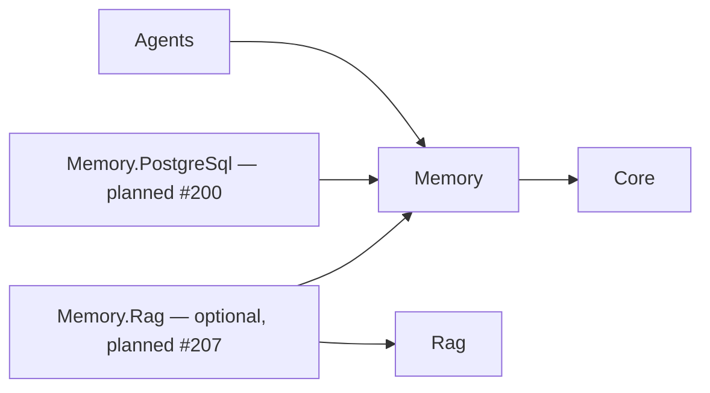

# Memory foundation delivery (#199)

This change delivers configuration, identity and authorization foundations. It does
not deliver durable or multi-turn recall. No publication, deployment, release, commit,
or push is implied by implementing these issues.



Core does not reference Memory. Memory public contracts contain no Agents/executor or
HTTP request types; Core's existing hosting dependencies remain unchanged. Rag remains
independent of Memory. Merely installing Agents exposes Memory transitively without
activating it. PostgreSQL provider installation and selection remain explicit.

## Responsibility map

| PBI | Memory / provider responsibility | Agents / host / Dashboard responsibility |
| --- | --- | --- |
| #199 Configuration and ownership | Memory contracts, options, identity and authorization policies | Agent opt-in, authenticated HTTP adapter, executor checks, runtime preflight |
| #200 Conversation/message store (planned) | In-memory provider in Memory; SQL storage and migrations in Memory.PostgreSql; atomic ownership binding | Explicit provider composition by application |
| #201 Multi-turn model conversations (planned) | Existing ownership/storage contracts | Agents loads history only after successful authorization; model context and persistence orchestration |
| #202 Shared context budget (planned) | Neutral memory selection policies | Agents combines Memory and RAG context within model budget |
| #203 Hosted conversation continuation (planned) | Existing authorized storage contracts | Agents HTTP conversation adapters; Dashboard.Client conversation UI |
| #204 Deletion and retention (planned) | Memory lifecycle contracts/policies; selected stores enforce deletion | Agents host adapters; Dashboard.Client lifecycle controls |
| #205 Typed working memory (planned) | Typed neutral memory contracts/services and provider persistence | Agents orchestrates updates and model context |
| #206 Observability (planned) | Neutral Memory diagnostics/policies | Agents projects runtime diagnostics; Dashboard.Client presents them |
| #207 Semantic recall (planned) | Optional Memory.Rag adapter reuses Rag vector infrastructure; no base Memory -> Rag dependency | Agents orchestrates authorized recall |
| #208 Summarization (planned) | Provider-independent derived-memory contracts/services and persistence | Agents schedules summarization and assembles context |
| #209 Observational pilot (conditional, planned) | Derived-memory policies after basic summarization evaluation | Agents pilot orchestration and evaluation integration |

Memory behavior belongs in `Memory.Tests`; provider tests belong in the future
`Memory.PostgreSql.Tests` / `Memory.Rag.Tests`. Runtime/HTTP integration stays in
`Agents.Tests`, UI verification stays with Dashboard. Roadmap numbering is not an
extra hard dependency. #199 children follow `#210 -> #211 -> #212 -> #213`,
`#211 -> #214`, then `#211/#212/#213/#214 -> #215 -> #216`.

## Parent acceptance evidence

Paths below are repository-relative. Each row maps the parent acceptance criteria
to implementation and behavior evidence rather than claiming future features.

| #199 criterion | Child issues | Implementation / evidence |
| --- | --- | --- |
| Separate packable Memory project, solution inclusion, Agents reference | #210 | Memory.csproj, Runiq.AI.slnx; local build/pack; MemoryContractTests |
| Contracts/configuration/policies in Memory, adapters in Agents | #210–#215 | MemoryAuthorizationService, MemoryOptions, HTTP adapter and runtime preflight |
| Agents -> Memory -> Core, no reverse or executor contracts | #210, #214 | MemoryContractTests.Projects_KeepMemoryIndependentOfAgentsAndProviders |
| Transitive availability is disabled by default, needs no services | #211, #215 | AgentMemoryConfigurationTests; MemoryRuntimeTests.Disabled_DoesNotResolveMemoryServices |
| Foundation tests independent of Agents, integration tests in Agents | #210–#215 | Memory.Tests.csproj references only Memory; dedicated Agents Memory test classes |
| Concrete providers deferred to #200 | #210, #216 | No provider project/store scaffold; package README and responsibility map |
| Existing disabled-agent behavior preserved | #211, #214, #215 | Existing Agents suite plus disabled Memory runtime and continuation tests |
| Thread/Resource/Run/ProviderSession identities are distinct | #210, #214 | MemoryReference, MemoryAccessScope; MemoryContractTests, MemoryExecutorCompatibilityTests |
| Thread/resource scope, agent isolation, explicit sharing | #210, #211, #213 | MemoryOptionsTests, MemoryAuthorizationTests ownership matrix; package scope documentation |
| Tenant boundaries and straightforward single tenancy | #212, #213 | HttpMemoryIdentityTests, MemoryIdentityTests, ownership matrix |
| Verified host identity, no authorization by supplied IDs | #212, #213, #215 | HTTP claim mapping; MemoryChatBoundaryTests spoofed body/header input |
| Denial before history/model work | #213, #215 | MemoryRuntimeTests entry-point denial and BuiltInModel_DenialPrecedesProviderResolution |
| Unsupported executors fail explicitly; support matrix | #214, #216 | MemoryExecutorCompatibilityTests, runtime compatibility tests; matrix in Agents README |
| Responsibility map across Memory PBIs | #216 | Table above |
| Foundation completion does not claim durability or recall | #210–#216 | Memory README, Agents README, explicit #200/#201 handoff |
| All seven children preserve dependency direction | #210–#216 | Project boundary check, public-contract source review, solution build |

## Validation

Use the repository's normal solution build/test/pack workflow. The PostgreSQL RAG
regression suite needs the existing `docker-compose.rag-postgresql.yml`; Memory
foundation tests do not. Live paid model calls or CLI sessions are unnecessary.

```powershell
dotnet test tests/Runiq.AI.Memory.Tests
dotnet test tests/Runiq.AI.Agents.Tests
dotnet build Runiq.AI.slnx -c Release
dotnet test Runiq.AI.slnx -c Release --no-build
dotnet pack Runiq.AI.slnx -c Release --no-build -o artifacts/packages
```

Local validation on 2026-09-27:

| Check | Result |
| --- | --- |
| Release solution build | Passed, 0 errors |
| Release solution tests | 1,599 passed, 0 failed, 5 skipped across 8 test projects |
| Memory.Tests | 23 passed, independent of Agents |
| Agents.Tests | 729 passed, 5 existing opt-in live CLI tests skipped; 43 new Memory cases |
| PostgreSQL regression tests | 29 passed after starting the repository's test database |
| Local solution pack | Passed; no publishing |
| Extracted Memory/Agents documentation C# examples | Compiled successfully in a temporary consumer project with explicit host adapter stubs |
| Test-reporting script | 12 scenarios passed |
| Whitespace/diff check | Passed |

The initial baseline failed PostgreSQL integration because its local database was
unavailable; the final run above includes the healthy database and passes. Existing
NU1902 warnings for Microsoft.Build.Tasks.Git 8.0.0 remain; pack also reports the
existing NU5104 prerelease PdfPig dependency and non-packable sample warning. No
unrelated dependency upgrade was made. Five live CLI tests require explicit opt-in
and were not executed. No historical test count is a completion requirement.

Documentation host adapters are explicitly application-supplied until #200 implements
authoritative persistence. Build/test logs, TRX files and local packages were written
under the operating system temporary directory, outside the review working tree.

## Review corrections

The two Major findings were addressed without changing Memory policy behavior:

- Twelve source files now use the RAG-style `Models`, `Abstractions`, `Configuration`,
  `Services`, `DependencyInjection`, and `Validation` directories and matching namespaces.
  The [package guide](../src/Runiq.AI.Memory/README.md#delivery-boundaries-and-validation)
  lists every moved type and the required imports for the prior working-tree API.
  Type/member bodies remain unchanged; no compatibility types or extra framework layer
  were introduced. Agents' existing Memory hosting and compatibility file locations remain intact.
- Unexpected service-resolution, identity-resolution, and authorization exceptions now
  reach the existing runtime logger with the original exception, `RunId`, `AgentId`,
  and `MemoryPreflightStage`. Structured fields contain no identity, credentials,
  claims, references, or message content. Expected denial and caller cancellation
  remain unlogged; safe client codes and messages are unchanged.

Review validation: Release solution build passed with 0 errors and the existing 8
NU1902 warnings. Memory tests: 23 passed. Agents tests: 751 passed, 0 failed, 5 existing
live CLI cases skipped, including 22 new preflight diagnostic scenarios covering both
execution APIs, dependency faults, correlation, cancellation and denial. Updated
documentation examples compiled successfully, and the diff whitespace check passed.
The full solution test totals above describe the original implementation run; this
review correction reran the affected Memory and Agents suites. No commit or push was made.
